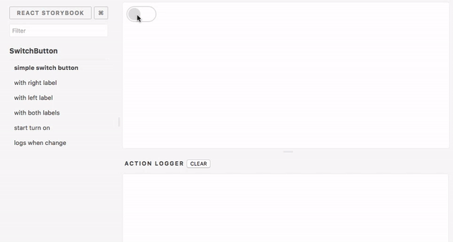
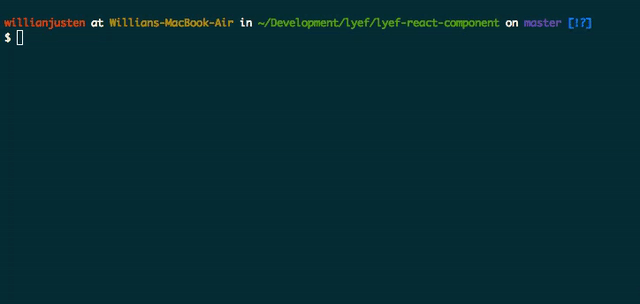
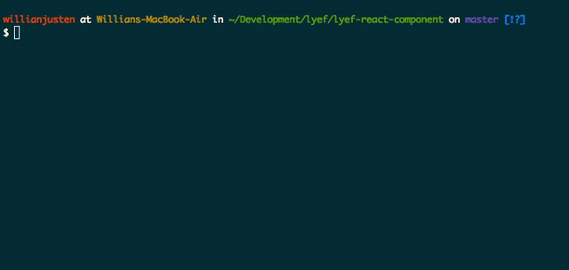
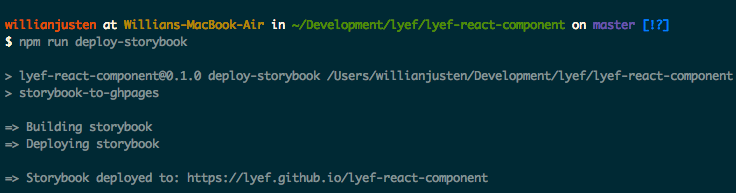

# Lyef React Component
[](https://travis-ci.org/lyef/lyef-react-component/)


[](http://badges.enytc.com/for/npm/lyef-react-component)

> An opinionated boilerplate for reusable and declouped react components.

The main idea of this project was based on develop decoupled components in a isolated environment. We don't need to use an entire application to build our components, we just need some place to run and test them.

## Getting Started

### Installation

For now, you can clone this repo or use the [slush generator](https://github.com/lyef/slush-lyef-react). We are creating a [CLI](https://github.com/lyef/lyef-react-cli) also.

**You’ll need to have Node >= 4 on your machine.** We recommend to use Node >= 6 and npm >= 3 for faster installation speed and better disk usage.

### Folders and Files

```sh
├── css
│   └── main.css
├── src
│   └── Main.js
├── stories
│   └── Main.js
├── storybook
│   ├── config.js
│   └── webpack.config.js
├── tests
│   ├── helpers
│   │   └── setup.js
│   └── specs
│       └── Main.spec.js
├── .babelrc
├── .editorconfig
├── .eslintrc
├── .gitignore
├── .npmignore
├── .travis.yml
├── CONTRIBUTING.md
├── LICENSE.md
├── Readme.md
└── package.json
```

## Creating your Component

### Writing your code

Write your component code on `src/Main.js`, you can create another files for composable components also.

```js
import React from 'react';
import PropTypes from 'prop-types';

const Component = ({ name }) => (
    <h1>Hello {name}!</h1>
);

Component.propTypes = {
    name: PropTypes.string.isRequired,
};

export default Component;
```

### Writing Stories



Stories are like behavior or states that our components should have. Such as an activated button, labels, whatever your component can change by props/states.

You can also see them as user stories for the agile development.

To understand more about that, I suggest you to read the [storybook stories guide](https://storybook.js.org/basics/guide-react/). Follow the example above:

```js
storiesOf('Component', module)
    .add('with lyef name', () => (
        <Component name="lyef" />
    ))
    .add('with another name', () => (
        <Component name="another" />
    ))
```

Every new story will be available on the left side panel of React Storybook to see different cases.

### Running your code



Just use `npm start`, Runs the app in development mode.
Open [http://localhost:9001](http://localhost:9001) to view it in the browser.

The page will reload if you make edits and you will see the build errors and lint warnings in the console.

### Running tests



We encourage everyone to write tests to your components, this can help us to create a more maintainable and free of bugs component. To do that, we create 3 tasks:

- `npm test`: run your tests in a single-run mode.
- `npm run test:tdd`: run and keep watching your test files.
- `npm run test:coverage`: prints and create html files by istanbul coverage.

### Linting your code

In order to keep your code clean and consistent we use [eslint](http://eslint.org/) with [Airbnb preset](https://github.com/airbnb/javascript/tree/master/react). We have 2 tasks for this:

- `npm run lint`: lint all files searching for errors.
- `npm run lint:fix`: fix automaticaly some lint errors.

### Deploy your component



You can deploy your component (inside Storybook) to `github pages` running the command `npm run deploy-storybook`.

## Why use this?

We believe that start to code shouldn't be hard, so you don't need to concern about configurations and tools, just create your pretty stuff. With this structure, your environment will have everything you need to build a modern React Component:

- React, JSX and ES6 support with Babel.
- A dev server with live reload
- Stack for tests
- Linters
- A build script to compile and minify for production

## What we use?

#### Environment

[React Storybook](https://github.com/kadirahq/react-storybook) - *to tell stories with different behaviors of the component and provide an example page.*

#### Style Guide

- [EditorConfig](http://editorconfig.org/) - *standardize some general settings among multiple editors*
- [ESLint](http://eslint.org/) - *for reporting the patterns of code*
  - [Airbnb JavaScript Style Guide](https://github.com/airbnb/javascript)
  - **Plugins**
    - [React](https://github.com/yannickcr/eslint-plugin-react)
    - [A11y](https://github.com/evcohen/eslint-plugin-jsx-a11y)
    - [Import](https://github.com/benmosher/eslint-plugin-import)

#### Tests
- [Mocha](https://github.com/mochajs/mocha) - *test framework*
- [Chai](https://github.com/chaijs/chai) - *assertions*
- [Enzyme](https://github.com/airbnb/enzyme) - *shallow component*
- [Jsdom](https://github.com/tmpvar/jsdom) - *mock the browser*

#### Compiler

- [babel](https://babeljs.io/)
  - **Plugins**
    - [Airbnb](https://github.com/airbnb/babel-preset-airbnb)
    - [ES2015](https://www.npmjs.com/package/babel-preset-es2015)
    - [React](https://www.npmjs.com/package/babel-preset-react)

## Code Standarts

This project uses [eslint](http://eslint.org/) and [.editorconfig](http://editorconfig.org/) is defined to have indent_size of **4 spaces**. You can change that on [.eslintrc](https://github.com/lyef/lyef-react-component/blob/master/.eslintrc#L16) file.

This project also uses [Husky](https://github.com/typicode/husky) to prevent to push code with lint errors or broken tests. If you don't want this, you can uninstall running `npm uninstall --save-dev husky` and deleting the [prepush command](https://github.com/lyef/lyef-react-component/blob/master/package.json#L21) on `package.json`.

## Contributing

We'd love to have your helping hand on our lyef-react-component! See [CONTRIBUTING.md](https://github.com/lyef/lyef-react-component/blob/master/CONTRIBUTING.md) for more information on what we're looking for and how to get started.

## License

[MIT License](https://github.com/lyef/lyef-react-component/blob/master/LICENSE.md) @ [lyef](https://lyef.github.io)
